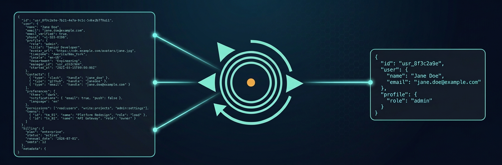

<!-- Hero banner — placeholder, replace with docs/images/banner.png -->
<p align="center">
  
</p>

<h1 align="center">rest-magpie</h1>

<p align="center">
  <em>REST that picks only the shiny bits.</em>
</p>

<p align="center">
  <a href="https://github.com/ed-smartass/rest-magpie/actions/workflows/ci.yml"></a>
  <a href="https://www.npmjs.com/package/rest-magpie"></a>
  <a href="LICENSE"></a>
  <a href="https://modelcontextprotocol.io"></a>
</p>

---

> Your agent burned 12K tokens on a 200KB JSON response — to read one field. Again.

`rest-magpie` is an MCP server that wraps arbitrary REST API calls so your agent **first sees a compact schema**, then pulls **only what it asked for** through a jq mask. Big responses stay out of context until you actually need a slice.

```
fetch  → cache  → schema (default)  → jq mask  → field value
                  ↑                  ↑
              "what's here?"     "give me .data[].id"
```

## TL;DR

- **`http_request`** runs the call, caches the body, returns the **structure**, not the bytes.
- **`http_read`** pulls fields out of the cached body via `jq`.
- **`http_inspect`** re-renders the schema in another format — no second HTTP call.

---

## Install

**npm (recommended):**
```jsonc
// claude_desktop_config.json or any MCP-compatible client config
{
  "mcpServers": {
    "rest-magpie": {
      "command": "npx",
      "args": ["-y", "rest-magpie"]
    }
  }
}
```

**Docker:**
```jsonc
{
  "mcpServers": {
    "rest-magpie": {
      "command": "docker",
      "args": [
        "run", "-i", "--rm",
        // Same-path bind mount + MAGPIE_FILES_ROOT: the agent passes
        // ordinary host paths under /home/me/data and they "just work"
        // inside the container. Outside-the-root paths are rejected
        // with a clear `invalid_input` error.
        "-v", "/home/me/data:/home/me/data",
        "-e", "MAGPIE_FILES_ROOT=/home/me/data",
        "ghcr.io/ed-smartass/rest-magpie:latest"
      ]
    }
  }
}
```

The same-path bind mount is the recommended Docker pattern — agent paths translate transparently. Drop `MAGPIE_FILES_ROOT` if you want no path constraint (and you're sure about the security tradeoffs).

## Tools

| Tool | What it does |
|---|---|
| `http_request` | Run an HTTP request; cache the body; return a schema (and optionally the body for small responses). |
| `http_read` | Read a cached body, optionally filtered by a `jq` mask. Required for binaries (use `save_to`). |
| `http_inspect` | Re-render the cached body's schema in another format — no second HTTP call. |

## Schema formats

The same `/users` endpoint, four ways:

**`paths` (default)** — flat path listing, type + one example per leaf:
```
data[].id            : int    (e.g. 42)
data[].name          : string (e.g. "alice")
data[].roles[]       : string (e.g. "admin")
data[].profile.bio   : string|null
meta.total           : int    (e.g. 1247)
meta.next_cursor     : string|null

# 187 KB · data[]: 50 items
```

**`shape`** — TypeScript-like tree, more compact for deep data:
```
{
  data: [{
    id: int, name: string, roles: string[], profile: { bio: string|null }
  }] (50 items),
  meta: { total: int, next_cursor: string|null }
}
# 187 KB
```

**`sample`** — first item kept verbatim, rest collapsed; long strings auto-truncated:
```jsonc
{
  "data": [
    { "id": 42, "name": "alice", "roles": ["admin"], "created_at": "2026-05-09T..." },
    "...49 more"
  ],
  "meta": { "total": 1247, "next_cursor": "abc123" }
}
```

**`json_schema`** — standard JSON Schema (draft 2020-12), inferred via `genson-js`. Useful when feeding the schema back into a typed pipeline.

Pick the format that matches what the agent is doing: `paths` for "what fields exist", `shape` for "what's the structure", `sample` for "show me one realistic record", `json_schema` for downstream tooling.

## jq cheatsheet

```jq
# Pick specific fields              .data | map({id, name})
# Drop heavy fields                 .data | map(del(.payload, .raw_html))
# Filter rows                       .data | map(select(.role == "admin"))
# Filter + pick                     .data | map(select(.active) | {id, email})
# First N                           .data[:5]
# Pluck single value                .meta.total
# Pagination cursor                 .meta.next_cursor // empty
# Group by                          .data | group_by(.tag) | map({tag: .[0].tag, n: length})
# Stats                             .data | length, (map(.score) | add / length)
# Errors only                       .results | map(select(.error))
# Flatten nested                    [.. | objects | select(.id?) | {id, type}]
# Search by substring               .items | map(select(.title | test("regex"; "i")))
# Sort + take top N                 .events | sort_by(.created_at) | reverse | .[:10]
```

`output_mode: "all"` (default) returns single-output filters as their value, multi-output filters as an array. `output_mode: "first"` collapses to the first emitted value.

## Real-world examples

### 1. Explore an unknown REST endpoint

```
http_request {method: "GET", url: "https://api.someservice.io/v1/widgets"}
  → schema (paths) shows what's there: data[].id, data[].name, meta.next_cursor, …
http_read {cache_id, mask: ".data | map({id, name})"}
  → just the slice you need
```

### 2. Pull only `id` and `created_at` from GitHub issues

```
http_request {
  method: "GET",
  url: "https://api.github.com/repos/anthropics/claude-cookbooks/issues",
  headers: {accept: "application/vnd.github+json"}
}
http_read {cache_id, mask: ".[] | {id, created_at}"}
```

### 3. Upload an image via multipart

```
http_request {
  method: "POST",
  url: "https://upload.example.com/photos",
  headers: {authorization: "Bearer …"},
  multipart: { files: { photo: { path: "/host/photo.jpg", content_type: "image/jpeg" } } }
}
```

### 4. Stream a binary download to disk

```
http_request {
  method: "GET",
  url: "https://example.com/big.zip",
  download_to: "/tmp/big.zip"
}
  → response is never buffered in agent context; sha256 + byte count returned
```

## Configuration

All env vars are optional. Defaults match common-sense limits.

| Env var | Default | Purpose |
|---|---|---|
| `MAGPIE_DEFAULT_TIMEOUT_MS` | 30000 | per-request HTTP timeout |
| `MAGPIE_MAX_RESPONSE_BYTES` | 52428800 | hard cap on cached body size (50 MB) |
| `MAGPIE_CACHE_TTL_SECONDS` | 600 | cache entry lifetime (10 min) |
| `MAGPIE_AUTO_INCLUDE_BODY_BYTES` | 8192 | threshold for `include_body: "auto"` |
| `MAGPIE_JQ_TIMEOUT_MS` | 5000 | per-mask jq timeout |
| `MAGPIE_USE_NATIVE_JQ` | 0 | switch to subprocess jq (reserved, not heavily exercised in v0.1) |
| `MAGPIE_TLS_INSECURE` | 0 | skip TLS verification |
| `MAGPIE_SCHEMA_MAX_DEPTH` | 10 | recursion depth for schema renderers |
| `MAGPIE_SCHEMA_MAX_OBJECT_KEYS` | 200 | per-object key cap |
| `MAGPIE_SCHEMA_SAMPLE_MAX_STRING` | 100 | string truncation in samples |
| `MAGPIE_FILES_ROOT` | _(unset)_ | restricts `multipart.files[].path`, `download_to`, and `save_to` to canonical paths under this prefix; unset means no constraint |

## Compared to alternatives

| | `rest-magpie` | `fetch-mcp` | `curl + jq` |
|---|:---:|:---:|:---:|
| All HTTP methods | ✅ | ❌ | ✅ |
| Custom headers | ✅ | ✅ | ✅ |
| Multipart file uploads | ✅ | ❌ | ✅ |
| Schema-first responses | ✅ | ❌ | ❌ |
| Field filtering (jq) | ✅ | ❌ | manual |
| Doesn't dump 200KB into agent context | ✅ | ❌ | ❌ |
| Single permission grant | ✅ | ✅ | ❌ |

## License

MIT — see [LICENSE](LICENSE).

## Contributing

See [CONTRIBUTING.md](CONTRIBUTING.md) for branch naming, conventional-commit style, and the PR flow. Bug reports and feature ideas go in [GitHub Issues](https://github.com/ed-smartass/rest-magpie/issues).
